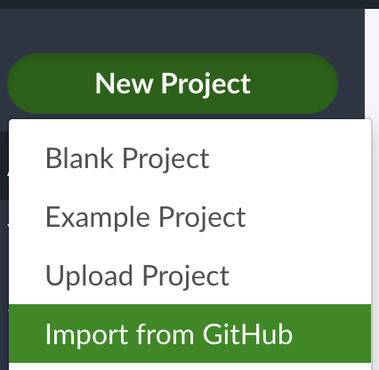
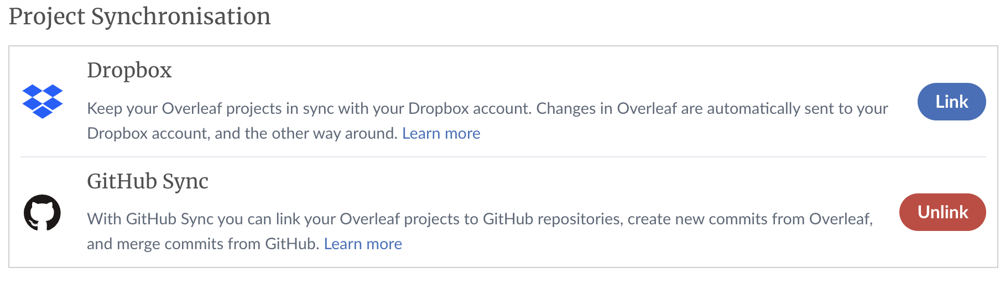
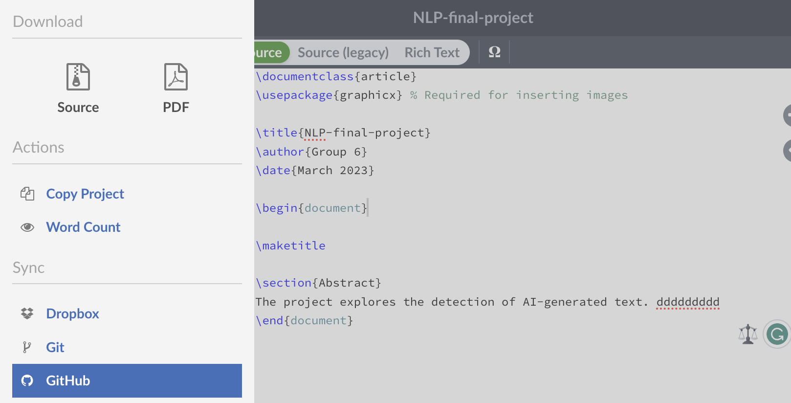
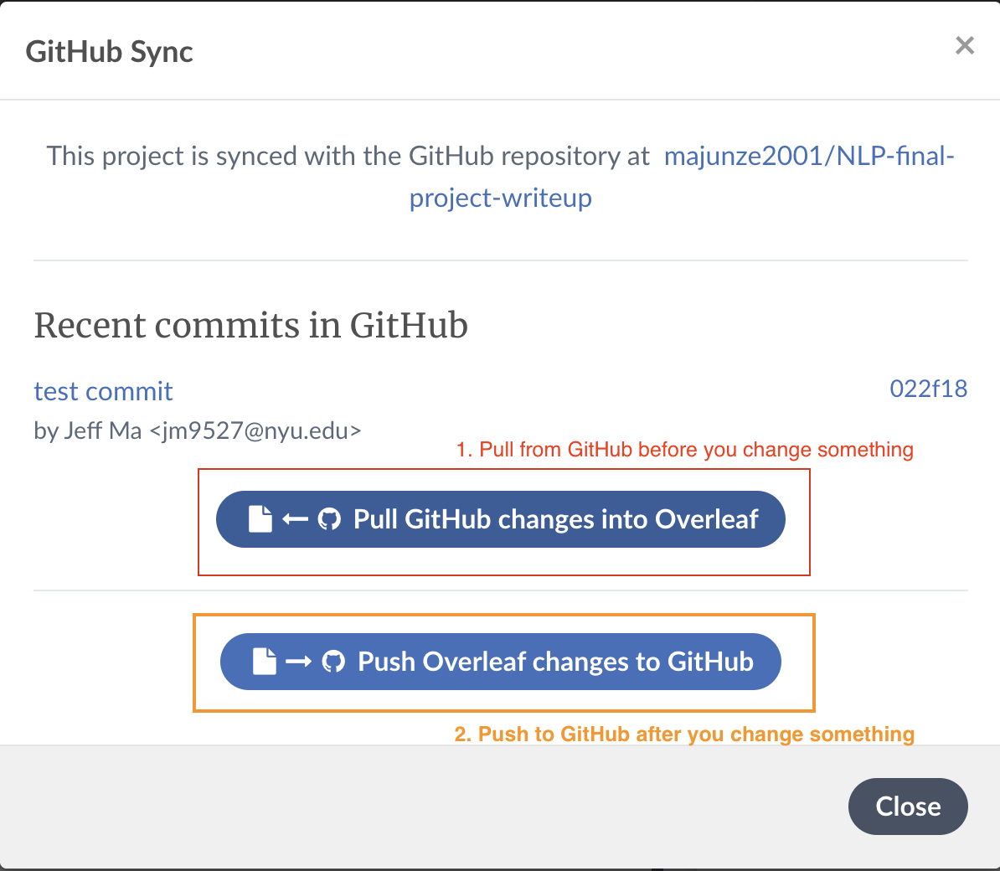

# NLP Final Project Repo 
Detection on generated text @NYU

## Main repo -- source code

[Model Link](https://drive.google.com/drive/folders/1eZ5NpirUX9BIzwzU115KoD2-pFCW9ice?usp=sharing)

## Write-ups 
Proposal and papers locate in `writeups`, connected with overleaf. 

### How to start
Go to your [Overleaf](https://www.overleaf.com/project) homepage --> New Project --> Import from GitHub --> find [NLP-final-project-writeup](https://github.com/majunze2001/NLP-final-project-writeup)

- If you do not have Overleaf GitHub Sync setup, go to [Overleaf Account Settings](https://www.overleaf.com/user/settings), set up GitHub Sync
  

### How to sync
Inside our Overleaf project, go to **Menu** --> **Sync** --> **Github**

> **Pull before you change something**

> **Push after you change something**

